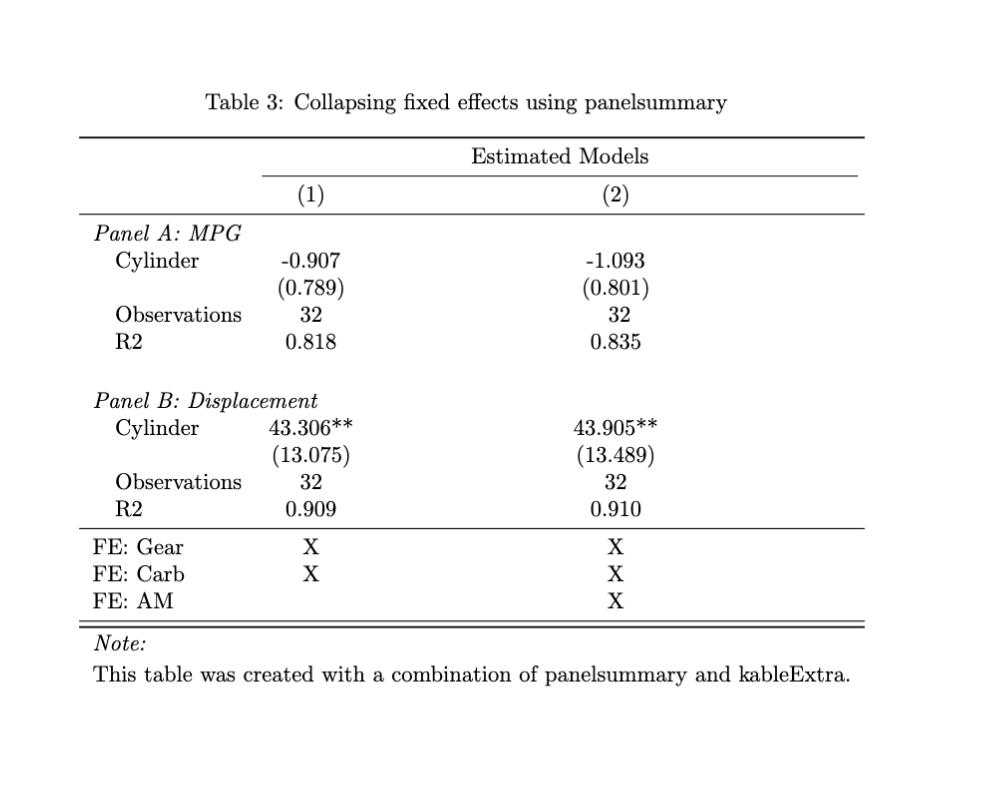

<!-- README.md is generated from README.Rmd. Please edit that file -->

```{r, include = FALSE}
knitr::opts_chunk$set(
  collapse = TRUE,
  comment = "#>",
  fig.path = "man/figures/README-",
  out.width = "100%",
  eval = F
)
```

# panelsummary

<!-- badges: start -->
```{r, echo = F}
usethis::use_github_action_check_standard()
usethis::use_coverage()
```

[](https://app.codecov.io/gh/michaeltopper1/panelsummary?branch=master)
[](https://github.com/michaeltopper1/panelsummary/actions/workflows/R-CMD-check.yaml)
<!-- badges: end -->

`panelsummary` creates publication-quality regression tables that have multiple panels. Paneled regression tables are particularly useful for showing output for models that are estimated with multiple dependent variables. A simple call to `panelsummary::panelsummary` will create a regression table that can be viewed in the RStudio Viewer panel, be edited with `kableExtra`'s suite of customization functions, and be output to latex. 

As of now, `panelsummary` is intended for use with the `fixest` package, although more model classes are planned. Please use the `panelsummary::models_supported` function to view a list of all model classes that are currently supported.

## Installation

You can install the development version of panelsummary from [GitHub](https://github.com/) with:

``` r
# install.packages("devtools")
devtools::install_github("michaeltopper1/panelsummary")
```

## What makes panelsummary different?

**Note: All tables shown are displayed as they appear when compiled to LaTeX**


As a motivating example, consider the following models:

```{r, eval = F}
library(fixest)
library(panelsummary)

## mpg regressions--------
mpg_model_1 <- mtcars |>
    fixest::feols(mpg ~  cyl | gear + carb, cluster = ~hp)

mpg_model_2 <- mtcars |>
    fixest::feols(mpg ~ cyl | gear + carb + am, cluster = ~hp)

## disp regressions --------
disp_model_1 <- mtcars |>
    fixest::feols(disp ~  cyl | gear + carb, cluster = ~hp)

disp_model_2 <- mtcars |>
    fixest::feols(disp ~  cyl | gear + carb + am, cluster = ~hp)


```

Observe that of the four models, the first two and last two mimic explanatory variables and differ only by dependent variables. Instead of creating a table for the two models with `mpg` as the dependent variable, and another for the two models with `disp` as the dependent variable, `panelsummary::panelsummary` can create one regression table with two (or more!) panels: 

```{r, eval = F}
example_table <- panelsummary(list(mpg_model_1, mpg_model_2), list(disp_model_1, disp_model_2), 
             num_panels = 2, 
             panel_labels = c("MPG", "Displacement"), 
             stars = T,
             caption = "The correlation of cyl on disp and mpg",
             italic = T)
example_table
```

```{r, echo = F, eval = T}
knitr::include_graphics("man/figures/example_table.png")
```
With one simple function, a variety of customization has taken place. However, `panelsummary` has plenty more to offer.

### Customize with `kableExtra` and use familiar `modelsummary` arguments

`panelsummary` outputs an object with `kableExtra` class. This means that editing with `kableExtra`'s functions is as simple as piping in `kableExtra` functions. Moreover, the backend of `panelsummary` calls `modelsummary`, and therefore, many `panelsummary` arguments are shared with `modelsummary` and work entirely the same. For instance, to reduce/rename the number of statistics shown on the table and clean up the variable names, you can use the arguments, `gof_map` and  `coef_map` exactly as you would in `modelsummary`:

```{r}
## creating a tibble to include only observati59ons and fixed effects
gm <- tibble::tribble(
    ~raw,        ~clean,          ~fmt,
    "nobs",      "Observations", 0,
    "r.squared", "R2", 3,
    "FE: gear", "FE: Gear", 0,
    "FE: carb", "FE: Carb", 0,
    "FE: am", "FE: AM", 0)


## adding in the gof_map and coef_map arguments - identical to modelsummary
panelsummary(list(mpg_model_1, mpg_model_2), list(disp_model_1, disp_model_2), 
             num_panels = 2, 
             panel_labels = c("MPG", "Displacement"), 
             stars = T,
             caption = "Using mapping arguments as in modelsummary and customizing with kableExtra",
             gof_map = gm,
             coef_map = c("cyl" = "Cylinder")) |>
  add_header_above(c(" " = 1, "Estimated Models" = 2)) |>
  footnote("This table was created with a combination of panelsummary and kableExtra.")

```

```{r, echo = F, eval = T}
knitr::include_graphics("man/figures/example_table_2.png")
```

### Collapsing fixed effects

While the tables displayed are clear, there is a lot of redundant information in the fixed effects. It is common that multiple dependent variables are tested against the same variety of models. To increase clarity, you can collapse the fixed effects to their own panel using the `collapse_fe` argument:

```{r}
panelsummary(list(mpg_model_1, mpg_model_2), list(disp_model_1, disp_model_2), 
             num_panels = 2, 
             panel_labels = c("MPG", "Displacement"), 
             stars = T,
             caption = "Collapsing fixed effects using panelsummary",
             gof_map = gm,
             coef_map = c("cyl" = "Cylinder"),
             collapse_fe = T,
             italic = T) |>
  add_header_above(c(" " = 1, "Estimated Models" = 2)) |>
  footnote("This table was created with a combination of panelsummary and kableExtra.")
```

```{r, echo = F, eval = T}

```


